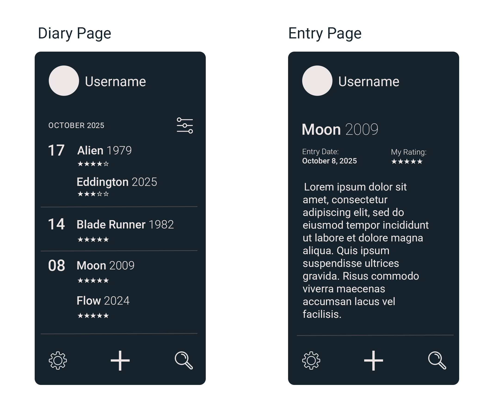

# Vulpecula

English | [Русский](README_RU.md)

**Vulpecula** is an educational Kotlin/Ktor backend project: an RPC-style HTTP API for a movie viewing diary. Users can keep a history of watched movies, save ratings and comments, build a personal viewing collection, and receive statistics about their preferences.

The project was developed as part of the **Kotlin Backend Developer** course, cohort **2025-08**.

The project is named after the Vulpecula constellation, Latin for “little fox”, in memory of a beloved corgi who was affectionately called a “little fox”.

## Project Overview

**Vulpecula** demonstrates the development of a high-load backend application in Kotlin with modular architecture, an OpenAPI contract, layer separation, testing, and preparation for containerization.

This is not a production service. It is an educational project intended to demonstrate an approach to designing a high-load backend application, organizing code, and maintaining project documentation.

## Technologies

- Kotlin
- Ktor
- Gradle
- OpenAPI Generator
- Jackson
- Kotlinx Serialization
- JUnit
- Testcontainers
- Docker Compose
- RabbitMQ
- DynamoDB

## API Style

Vulpecula uses an RPC-style HTTP API: operations are exposed as action-oriented POST endpoints rather than classic REST resources. This API style is defined by the architectural requirements of the course.

## What the Project Demonstrates

- Backend development with Kotlin and Ktor
- HTTP API design and OpenAPI contract definition
- Application design based on Clean Architecture principles
- Separation of business logic, transport layer, and infrastructure
- Framework-agnostic approach: business logic does not depend on Ktor
- Database-agnostic approach: domain and business logic are not tied to a specific database
- Separation of transport, domain, and business models
- Mapping between application layers
- Modular Gradle project structure
- Unit testing of serialization, mappers, and business logic
- Preparation for e2e testing and containerization
- Integration with a message broker
- Preparation for working with NoSQL storage

## Main Features

- Create a movie viewing diary entry
- Read a diary entry
- Update rating, comment, and viewing data
- Delete an entry
- Use stubs for testing business scenarios
- Describe the API through an OpenAPI specification
- Generate transport models from the contract

## Architecture in Brief

The project is split into modules by responsibility:

- API and transport models
- Shared domain models
- Business logic
- Repository
- Mappers between layers
- Stubs for scenario testing

Business logic is separated from Ktor, transport models, and the specific data storage implementation. This makes it possible to change the external API, framework, or database with less impact on the application core.

## Project Status

The project is currently in development as an educational backend project.

Part of the functionality is implemented in code, while some parts are described in the documentation as project requirements, architectural decisions, and planned scenarios.

## Frontend Prototype

## Documentation

1. Marketing and Analytics
   1. [Target Audience](docs/en/01-biz/01-target-audience.md)
   2. [Stakeholders](docs/en/01-biz/02-stakeholders.md)
   3. [User Stories](docs/en/01-biz/03-user-stories.md)
2. Analysis
   1. [Functional Requirements](docs/en/02-analysis/01-functional-requirements.md)
   2. [Non-Functional Requirements](docs/en/02-analysis/02-nonfunctional-requirements.md)
3. Architecture
   1. [ADR](docs/en/03-architecture/01-adr.md)
   2. [API Description](docs/en/03-architecture/02-api-description.md)
   3. [Architecture Diagrams](docs/en/03-architecture/03-architecture-diagrams.md)
4. Testing
   1. [Tests List](docs/en/05-testing/01-tests-list.md)
